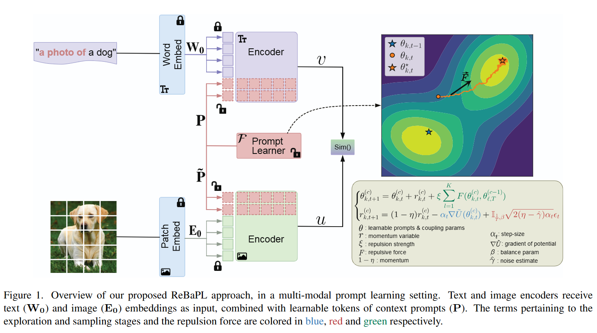

# ReBaPL: Repulsive Bayesian Prompt Learning

### CVPR 2026

> **ReBaPL: Repulsive Bayesian Prompt Learning**<br>
> Yassir Bendou\*, Omar Ezzahir\*, Eduardo Fernandes Montesuma\*, Gabriel Mahuas, Victoria Shevchenko, Mike Gartrell<br>
> _\* Equal contribution_

[[Paper]](https://arxiv.org/abs/2511.17339)

<hr>

## Highlights



ReBaPL is a modular, plug-and-play Bayesian extension for prompt learning methods in vision-language models. It introduces **Repulsive Cyclical SGHMC (rcSGHMC)**, which:

- Uses **Hamiltonian dynamics** with cyclical learning rates to alternate between exploration and exploitation phases when sampling from complex multimodal posterior distributions of prompts.
- Introduces a **representation-based repulsive force** derived from probability metrics (MMD and Wasserstein distance) computed on prompt-induced feature distributions, encouraging diverse mode discovery and preventing premature convergence.
- Produces a **Bayesian ensemble** of prompt samples that provides richer characterization of the posterior, leading to improved generalization on base-to-novel tasks, cross-dataset transfer, and domain generalization.

ReBaPL can extend any existing MLE-based prompt learning method. We demonstrate it on top of [MaPLe](https://github.com/muzairkhattak/multimodal-prompt-learning) and [MMRL](https://github.com/guo-pu/MMRL).

<hr>

## Installation

This codebase is tested on Ubuntu 20.04 with Python 3.8. Follow the steps below to set up the environment.

**1. Create conda environment**
```bash
conda create -y -n rebapl python=3.8
conda activate rebapl

# Install PyTorch (>= 1.8.1). Adjust the CUDA version to match your system.
pip install torch==1.9.0+cu111 torchvision==0.10.0+cu111 torchaudio==0.9.0 \
    -f https://download.pytorch.org/whl/torch_stable.html
```

**2. Install the [Dassl](https://github.com/KaiyangZhou/Dassl.pytorch) library**
```bash
git clone https://github.com/KaiyangZhou/Dassl.pytorch.git
cd Dassl.pytorch/
pip install -r requirements.txt
python setup.py develop
cd ..
```

**3. Clone ReBaPL and install requirements**
```bash
git clone https://github.com/SigmaNova/ReBaPL.git
cd ReBaPL/
pip install -r requirements.txt
pip install setuptools==59.5.0
```

**4. Data preparation**

Please refer to [DATASETS.md](docs/DATASETS.md) for instructions on how to install the 11 benchmark datasets. We recommend placing all datasets under a single directory (e.g., `~/datasets`).

<hr>

## Training and Evaluation

### Base-to-Novel Generalization

**Quick start** using the convenience script:

```bash
# Usage: bash run_ours.sh <dataset> <seed> [cfg] [gpu_id] [overwrite]
bash run_ours.sh eurosat 1 vit_b16 0 false
```

This runs both training on base classes and evaluation on novel classes.

**Step-by-step:**

```bash
# Train on base classes
bash scripts/csghmc_cold_restarts_maple/base2new_train.sh eurosat 1 vit_b16

# Evaluate on novel classes
bash scripts/csghmc_cold_restarts_maple/base2new_test.sh eurosat 1 vit_b16
```

**With custom hyperparameters** (e.g., for sweeps):

```bash
python train.py \
    --root ~/datasets \
    --seed 1 \
    --trainer CSGHMC_CR_MAPLE \
    --dataset-config-file configs/datasets/eurosat.yaml \
    --config-file configs/trainers/CSGHMC_CR_MAPLE/vit_b16.yaml \
    --output-dir output/base2new/train_base/eurosat/shots_16/CSGHMC_CR_MAPLE/vit_b16/seed1 \
    DATASET.NUM_SHOTS 16 \
    DATASET.SUBSAMPLE_CLASSES base \
    CSGHMC.REPULSION.REPULSION_STRENGTH 0.75 \
    CSGHMC.REPULSION.DISTANCE_TYPE wasserstein \
    OPTIM.MAX_EPOCH 15
```

Config overrides can be passed as trailing key-value pairs on the command line.

### Supported Datasets

ImageNet, Caltech101, OxfordPets, StanfordCars, Flowers102, Food101, FGVCAircraft, SUN397, DTD, EuroSAT, UCF101

Plus OOD variants: ImageNetV2, ImageNet-Sketch, ImageNet-A, ImageNet-R

### Parsing Results

```bash
python parse_test_res.py output/base2new/test_new/eurosat/shots_16/CSGHMC_CR_MAPLE/vit_b16 --test-log
```

<hr>

## Key Configuration

The main config files are in [configs/trainers/CSGHMC_CR_MAPLE/](configs/trainers/CSGHMC_CR_MAPLE/). Below are the hyperparameters used in our experiments (Table 1 of the paper):

| Hyperparameter | MaPLe + ReBaPL | MMRL + ReBaPL |
|---|---|---|
| Learning rate *α* | 0.002 | 0.001 |
| Batch size *b* | 1 | 4 |
| Epochs per cycle *T* | 5 | 5 |
| # Cycles *C* | 3 | 3 |
| Samples per cycle *K* | 1 | 1 |
| Repulsion strength *ξ* | 0.001 | 10⁻⁴ |
| Repulsion batch size *n* | 32 | 64 |
| Distance | MMD | Wasserstein |
| Algorithm | rcSGHMC | rcSGHMC |
| Weight decay | 5e-4 | 5e-4 |
| Random seed | [1, 2, 3] | [1, 2, 3] |

<hr>

## Citation

If you find this work useful, please cite our paper:

```bibtex
@article{bendou2025rebapl,
  title={ReBaPL: Repulsive Bayesian Prompt Learning},
  author={Bendou, Yassir and Ezzahir, Omar and Montesuma, Eduardo Fernandes and Mahuas, Gabriel and Shevchenko, Victoria and Gartrell, Mike},
  journal={arXiv preprint arXiv:2511.17339},
  year={2025}
}
```

## Acknowledgements

Our codebase builds on [MaPLe](https://github.com/muzairkhattak/multimodal-prompt-learning), [PromptSRC](https://github.com/muzairkhattak/PromptSRC), and [Dassl](https://github.com/KaiyangZhou/Dassl.pytorch). We thank the authors for releasing their code.
